## WEB STACK IMPLEMENTATION (MERN) IN AWS


**Introduction**

As a DevOps Engineer In training on Steghub, I learned to deploy a `MERN` stack application on AWS. The `MERN` stack is a JavaScript stack designed to make the development process smoother. MERN includes four open-source components: **M**ongoDB, **E**xpress, **R**eact, and **N**ode. These components provide an end-to-end framework for web developers to work in. In this documentation, I will be demonstrating how to successfully deploy a `MERN` stack application on AWS.

# Prerequisites

Before we begin let's make sure you are all set to proceed. Below are the prerequisites for this project:

- [x] **AWS Account**: You need to have an AWS account to begin with. If you don't have one, you can create one [here](https://aws.amazon.com/).

- [x] **Basic Understanding of JavaScript**: You can get up to speed with JavaScript basics [here](https://developer.mozilla.org/en-US/docs/Learn/Getting_started_with_the_web/JavaScript_basics).

- [x] **Basic Understanding of React**: You can check out this page [here](https://legacy.reactjs.org/tutorial/tutorial.html).
- [x] **Basic Understanding of Node.js**: You can check out this simple intro [here](https://nodejs.dev/learn).
- [x] **Basic Understanding of MongoDB**: You can check out this simple intro [here](https://www.mongodb.com/company/what-is-mongodb).

## Task - 101 Prepare MERN Pre-requisites

Before we can deploy the  `MERN` stack application on AWS, we need to prepare the following prerequisites:

- [x] **Set up AWS Account**.
- [x] **Create an Ubuntu EC2 Instance**
- [x] **Update firewall rules**


Our EC2 Instance is now ready for the next steps for developing and deploying the TO-DO web up on the MERN stack.
The TO-DO web application will have a backend infrastructure using Node.js and Express.js, a frontend using React.js, and a NOSQL database set up using MongoDB. our Ubuntu EC2 instance will be the host for the backend and frontend of the application.
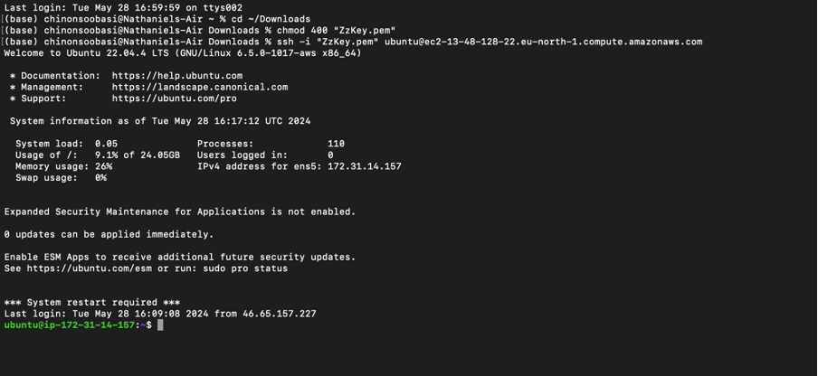

For the next steps, let's configure our Backend.

## Task - 102 Configure Backend
in this task, we will be configuring the backend of our TO-DO web application. The backend will be set up using Node.js and Express.js. We will also set up a NOSQL database using MongoDB.

### Install Node.js
`Node.js` will be used to run the backend logic for our TO-DO web app written in JavaScript. [Node.js](https://nodejs.org/en) uses an event-driven, non-blocking I/O model that makes it lightweight and efficient. It is perfect for data-intensive real-time applications that run across distributed devices.

To install Node.js, run the following commands:

```bash
sudo apt update
```
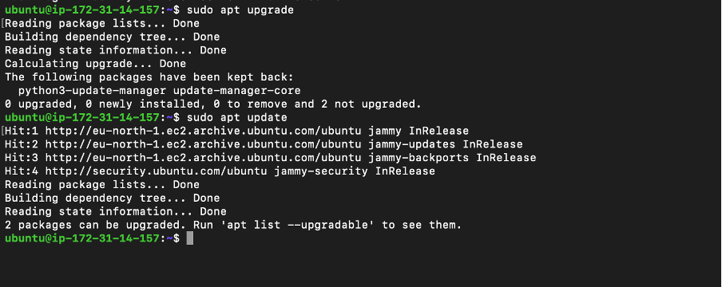


Add repository for Node.js package for Ubuntu. Doing so will allow us to install the latest version of Node.js.
```bash
curl -fsSL https://deb.nodesource.com/setup_18.x | sudo -E bash -
```
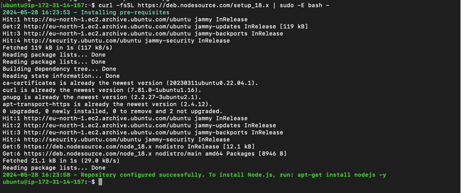

Install the Latest Node.js package for Ubuntu.
```bash
sudo apt-get install -y nodejs
```
The above command will install node and [npm](https://www.npmjs.com/), the package manager for Node.js. package managers help developers to install, update, configure, and uninstall code libraries and dependencies.

now let's check the version of Node.js and npm installed.
```bash
node -v
npm -v
```
The output should be the version of Node.js and npm installed.

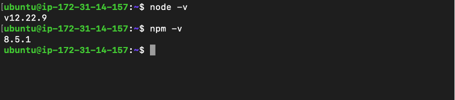

great! Node.js and npm are now installed on our EC2 instance. Next, we will set up the directory structure for the TO-DO app. This helps to keep the codebase organized and maintainable.

### Set up Directory Structure

Create a directory for the TO-DO app.
```bash
mkdir Todo && cd Todo
```
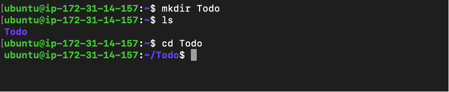
With this command, we created and changed into the Todo directory. Next, we will initialize a new Node.js project in the Todo directory.

### Initialize Node.js Project

I initialized a new Node.js project in the Todo directory using the following command:
```bash
npm init
```

The `npm init` command creates a `package.json` file in the Todo directory. The `package.json` file contains metadata about the project and the dependencies required to run the project. Next, we will install the dependencies required to run the TO-DO app.
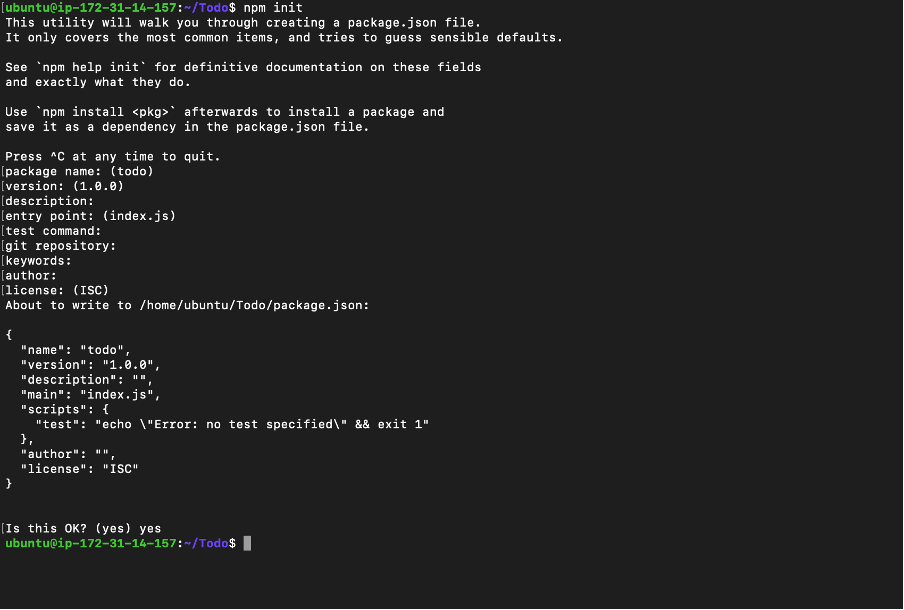

### Install Dependencies

One of the backend dependencies for our `MERN` web app is the Express.js framework. The development team will use Express.js to define the routes and handle requests from the frontend(we are yet to setup). To install Express.js, run the following command:

```bash
npm install express
```
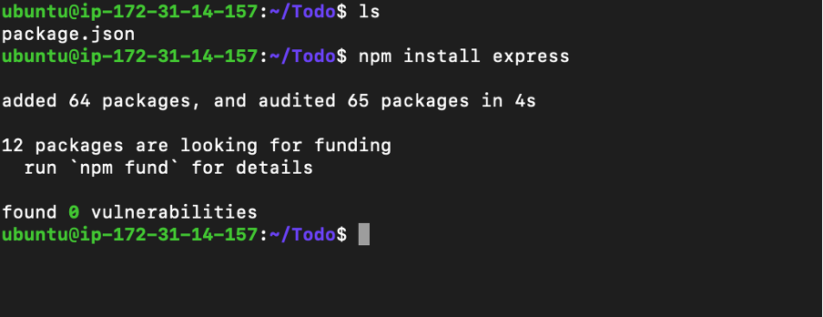

Great! Express.js is now installed in our project. Next up, we will create an index route for the TO-DO app to test if the backend is working as expected.

### Create Index Route

I created an index route in the `index.js` file in the Todo directory. The index route will be used to test if the backend is working as expected. Here is the code for the index route:

```bash
touch index.js
```

Run ls ton confirm that your index.js file is successfully created.
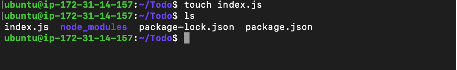

Install the dotenv module
```bash
npm install dotenv
```
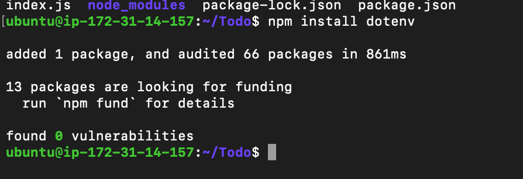

I will then define the index route in the `index.js` file. The index route will return a message to the client when the client makes a request to the route. Here is the code for the index route:

```javascript
const express = require('express');
require('dotenv').config();

const app = express();
// get the port from the environment variable or use port 5000
const PORT = process.env.PORT || 5000;

// define the index route
app.use((req, res, next) => {
    res.header("Access-Control-Allow-Origin", "\*");
    res.header("Access-Control-Allow-Headers", "Origin, X-Requested-With, Content-Type, Accept");
    next();
});

app.use((req, res, next) => {
    res.send('Welcome to the TO-DO app powered by MERN stack');
});

// start the server
app.listen(PORT, () => {
    console.log(`Server running on port ${PORT}`);
});
```

The code above defines an index route that returns a message to the client(the browser or another server) when the client makes a request to the route. The server listens on port 5000 by default. The [port number](https://www.google.com/search?q=what+are+port+numbers&oq=what+are+port+numbers&aqs=chrome..69i57j0i512l4j0i22i30l5.6222j0j7&sourceid=chrome&ie=UTF-8) can be changed by setting the `PORT` [environment variable.](https://www.geeksforgeeks.org/environment-variables-in-linux-unix/)

Notice how our express app is listening on port number `5000` by default. We need to ensure that our EC2 instance allows traffic on port 5000. We will do this by updating the inbound rules for the EC2 instance. I[ added a custom TCP rule](https://docs.aws.amazon.com/finspace/latest/userguide/step5-config-inbound-rule.html) for port 5000 to allow traffic from all IP addresses(not a particularly strict inbound rule but we'll manage).
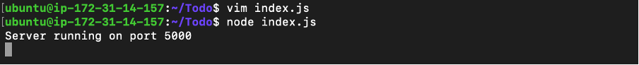

let's try it out in the browser. Open a browser and navigate to `http://<public-ip>:5000`. You should see the message "Welcome to the TO-DO app powered by MERN stack".

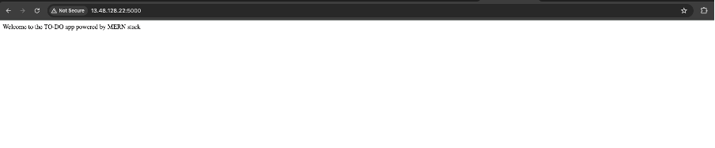
Great! The backend is working as expected. Before we do the next steps, let's quickly review what we have done so far.
We are setting up a MERN stack application on AWS. After spinning up an EC2 instance, we installed Node.js and npm. We then set up the directory structure for the TO-DO app and initialized a new Node.js project. We installed the Express.js framework and created an index route to test if the backend is working as expected. The index route returns a message to the client when the client makes a request to the route. We also updated the inbound rules for the EC2 instance to allow traffic on port 5000. The backend is now ready for the next steps.

### ah yes! your very own surprise side quest.

You have earned a quick pause for hydration :) when you return we'll define the routes for the TO-DO app.


## Task - 103 Define Routes for TO-DO App

Now that the backend is working as expected, let's put on our backend web developer hats and define some simple routes for our TO-DO app. Think of routes as being the different paths that a user can take to interact with the app. The routes will be used to perform [CRUD operations](https://www.freecodecamp.org/news/crud-operations-explained/) on the TO-DO app. CRUD stands for Create, Read, Update, and Delete. The routes we will design will help our users create a new TO-DO item, read all TO-DO items, update a TO-DO item, and delete a TO-DO item.

### Create Routes

we can define routes inside the `index.js` file but that would make the codebase messy and hard to maintain. To keep the codebase organized and maintainable, we will create a new directory called `routes` and define the routes in separate files. Let's create the `routes` directory and define the routes for the TO-DO app.

```bash
mkdir routes && cd routes
```

inside the `routes` directory, we will create a new file called `api.js` and define the routes for the TO-DO app. Here is the code for the `api.js` file:

```javascript
const express = require('express');
const router = express.Router();

// define the routes for the TO-DO app
router.get('/todos', (req, res, next) => {
    res.send('GET list of todos[feature comming soon]');
});

router.post('/todos', (req, res, next) => {
    res.send('POST:add a new todo [feature comming soon]');
});

router.put('/todos/:id', (req, res, next) => {
    res.send('PUT:update a todo [feature comming soon]');
});

router.delete('/todos/:id', (req, res, next) => {
    res.send('DELETE  an embaraasing todo item [feature comming soon]');
});

module.exports = router;
```

## Task - 104 Model TO-DO Items

We will use the routes defined inside the `api.js` in a moment. For now, we need to model the real-world idea of a TO-DO item. You can think of modeling as us defining a blueprint in Javasript for spawning TO-DO objects. The model will define the structure of a TO-DO item, giving it properties, and methods to interact with the TO-DO item.


| Field        | Type   | Description                              |
|--------------|--------|------------------------------------------|
| id           | String | A unique identifier for the TO-DO item.  |
| action       | String | The title of the TO-DO item.             |
| description  | String | A detailed description of the TO-DO item.|
| status       | String | The status of the TO-DO item.            |
| created_at   | Date   | The date and time when the TO-DO item was created. |
| updated_at   | Date   | The date and time when the TO-DO item was last updated. |


when these TO-DO objects are created by the user we need a way to persist them for retrieval later.(we don't want to lose our TO-DO items when the server is restarted). We will use a NOSQL database to store the TO-DO items. at the risk of sounding repetitive, we will use MongoDB as the NOSQL database.

### Set up NoSQL Database

We need to install a node.js package called `mongoose` to interact with MongoDB. Mongoose is an Object Data Modeling (ODM) library for MongoDB and Node.js. It provides a straightforward, schema-based solution to model the application data. To install mongoose, run the following command:

```bash
npm install mongoose
```
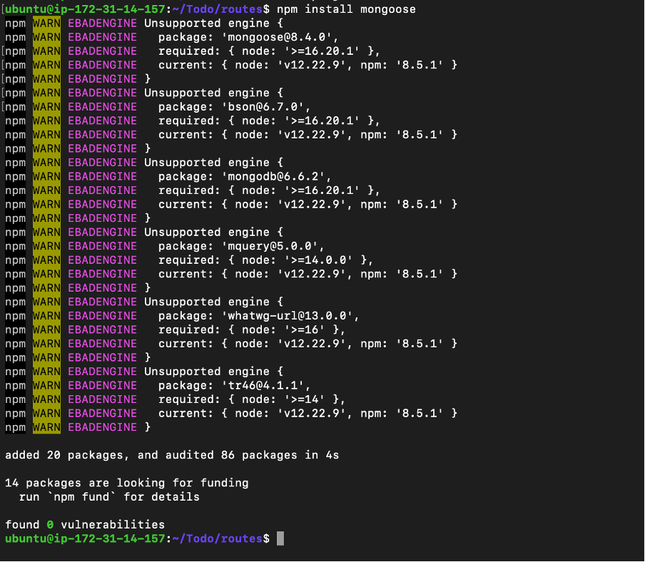

### Define TO-DO Models

We will define the TO-DO model in a new file called `todo.js` inside the `models` directory. Let's create the `models` directory and define the TO-DO model.

```bash
mkdir models && cd models && touch todo.js
```

Inside the `todo.js` file, we will define the TO-DO model. Here is the code for the `todo.js` file:

```javascript
const mongoose = require('mongoose');
const Schema = mongoose.Schema;

// define the TO-DO schema
const TodoSchema = new Schema({
    action: {
        type: String,
        required: true
    },
    description: {
        type: String,
        required: true
    },
    status: {
        type: String,
        required: true
    },
    created_at: {
        type: Date,
        default: Date.now
    },
    updated_at: {
        type: Date,
        default: Date.now
    }
});

// create the TO-DO model
const Todo = mongoose.model('Todo', TodoSchema);

module.exports = Todo;
```

### Integrate Routes and Models

Now that we have the blueprint for creating and storing todo items via `models/todo.js` and the half-baked API request endpoints defined in the `api.js`, it's time to fully implement the CRUD operations defined in the `api.js` file. We will use the `mongoose` package to interact with the MongoDB database. Let's integrate the routes and models.

```javascript
const express = require('express');
const router = express.Router();
const Todo = require('../models/todo');

// define the routes for the TO-DO app

// Retrieve all TO-DO items
router.get('/todos', (req, res, next) => {
    Todo.find({}, 'action')
        .then(data => res.json(data))
        .catch(next)
});

// add a new TO-DO item
router.post('/todos', (req, res, next) => {
    if(req.body.action){
        Todo.create(req.body)
            .then(data => res.json(data))
            .catch(next)
    }else{
        res.json({
            error: "The input field is empty"
        })
    }
});
// update todo item by id
router.put('/todos/:id', (req, res, next) => {
    Todo.findByIdAndUpdate({_id: req.params.id}, req.body)
        .then(() => {
            Todo.findOne({_id: req.params.id})
                .then(data => res.json(data))
        })
        .catch(next)

});

// delete todo item by id
router.delete('/todos/:id', (req, res, next) => {
    Todo.findByIdAndDelete({_id: req.params.id})
        .then(data => res.json(data))
        .catch(next)
});

module.exports = router;
```
At this point our backend is almost ready. We have all the API endpoints the client side will need to interact with the backend. We have also defined the TO-DO model to create the TO-DO items. The next step is to connect the backend to the MongoDB database. 


.

## Congratulations on making it this far 🥇


## Conclusion

In this project, we set up a MERN stack application development environment on AWS. We created a TO-DO app using the MERN stack. We set up the backend using Node.js and Express.js. We defined the routes for the TO-DO app and modeled the TO-DO items. 
